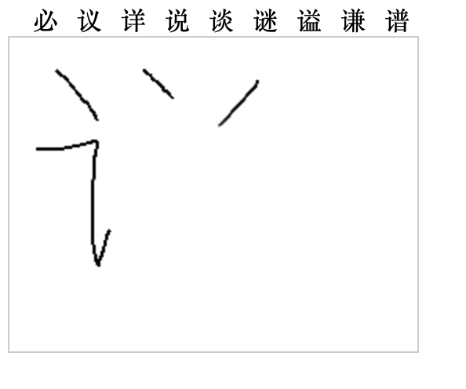
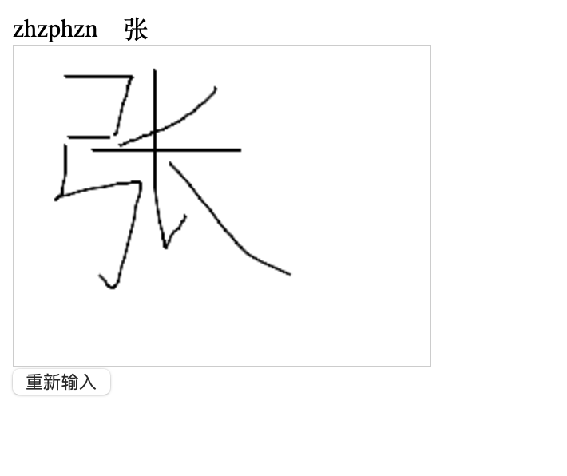

# 网页输入法

手写输入法

借鉴了 https://github.com/microcai/ibus-handwrite 项目

拼音输入法

https://github.com/kekxv/vue-pinyinKeyboard

参考借鉴 ： https://github.com/sxei/pinyinjs

## 效果

拼音
```js
console.log("pinyin:pin,", handwrite.pinyinmatch("pin"))
// [Log] pinyin:pin, – "品贫聘频拼拚颦姘嫔榀牝"
console.log("pinyin:yin,", handwrite.pinyinmatch("yin"))
// [Log] pinyin:yin, – "因引银印音饮阴隐姻殷淫尹荫吟瘾寅茵圻垠鄞湮蚓氤胤龈窨喑铟洇狺夤廴吲霪茚堙"
```

手写整体效果一般般，需要一笔一画的书写，且依赖顺序，后期考虑做笔划排序，以及笔划识别优化

手写


